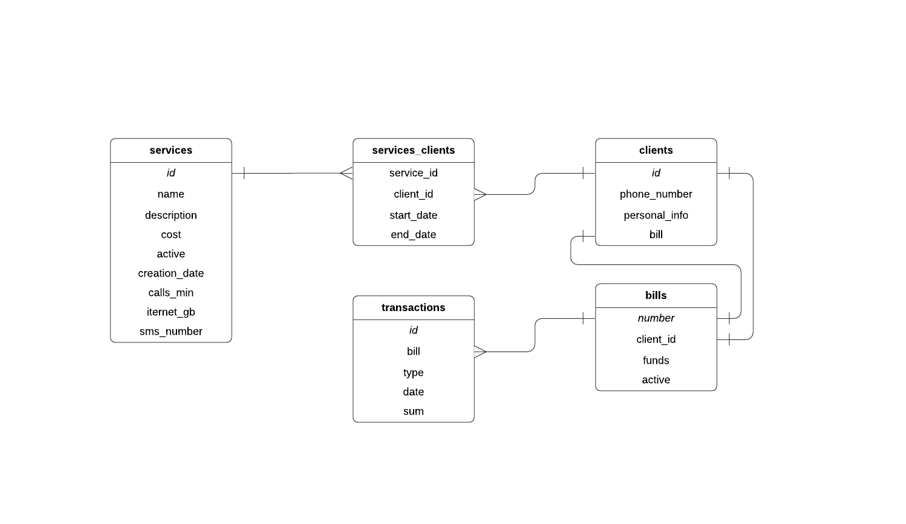

# cmc-web-prac
Web application of billing system for a mobile operator

# Схема БД

# Описание страниц
0. **Верхнее меню** (на всех страницах)
  * "Главная" -> ***Домашняя страница***
  * "Услуги" -> ***Услуги***
  * "Клиенты" -> ***Клиенты***

1. **Домашняя сраница**
  * Описание приложения
  * "Услуги" + описание раздела -> ***Услуги***
  * "Клиенты" + описание раздела -> ***Клиенты***

2. **Услуги**
  * Список всех доступных услуг вида:
    * id услуги
    * Название услуги (кликабельное) -> ***Услуга***
    * Краткое описание услуги
    * Стоимость
    * "Изменить" -> ***Создание/Изменение услуги***
    * "Удалить" -> (удаление)
  * "Новая услуга" -> ***Создание/Изменение услуги***
  * Поиск услуги по названию / id

3. **Клиенты**
  * Список всех клиентов вида:
    * id клиента
    * номер телефона (кликабельный) -> ***Клиент***
    * номер счета
    * "Изменить" -> ***Добавление/Изменение данных клиента***
    * "Удалить" -> (удаление)
  * "Новый клиент" -> ***Добавление/Изменение данных клиента***
  * Поиск клиента по номеру телефона

4. **Услуга**
  * Название услуги
  * Подробное описание услуги
  * Количество минут/смс/интернета(ГБ)
  * Стоимость
  * "Изменить" -> ***Создание/Изменение услуги***
  * "Удалить" -> (удаление услуги) -> ***Услуги***

5. **Создание/Изменение услуги**
  * Ввод названия услуги
  * Ввод описания услуги
  * Ввод стоимости услуги
  * Ввод количества минут/смс/интернета(ГБ)
  * Пометка активная/неактивная услуга
  * "Сохранить" -> (сохранение) -> ***Услуга***

6. **Клиент**
  * Номер телефона клиента
  * Номер счета (кликабельный) -> ***Транзакции***
  * Имя клиента
  * Адрес
  * E-mail
  * Активная услуга
    * id услуги
    * Назвние услуги (кликабельное) -> ***Услуга***
    * Дата приобретения услуги
    * Дата окончания действия услуги
    * "Отключить услугу"
  * История оказанных услуг:
    * id услуги
    * Назвние услуги (кликабельное) -> ***Услуга***
    * Дата приобретения услуги
    * Дата окончания действия услуги
  * "Подключить услугу" + окно выбора доступных услуг
  * "Изменить" -> ***Добавление/Изменение данных клиента***
  * "Удалить" -> (удаление клиента) -> ***Клиенты***

7. **Добавление/Изменение данных клиента**
  * Ввод имени клиента
  * Ввод телефона клиента
  * Ввод номера счета клиента
  * Ввод адреса / e-mail
  * Отключение текущей услуги / оказание новой услуги (через историю оказанных услуг)
  * "Сохранить" -> (сохранение) -> ***Клиент***

8. **Транзакции**
  * Номер счета
  * Количество средств на счете
  * История транзакций по счету:
    * Тип (пополнение/списание)
    * Сумма
    * Дата

# Сценарии использования
1. **Работа с предоставляемыми услугами**
  * Получение списка предоставляемых услуг
    * ***Домашняя страница*** -- "Клиенты" -> ***Клиенты*** (-- поиск клиента) -- <Клиент> -> ***Клиент*** -- "Подключить услугу"
  * Редактирование услуги
    * ***Домашняя страница*** -- "Услуги" -> ***Услуги*** (-- поиск услуги) -- <Услуга> -> ***Услуга*** -- "Изменить" -> ***Создание/Изменение услуги***
  * Удаление услуги
    * ***Домашняя страница*** -- "Услуги" -> ***Услуги*** (-- поиск услуги) -- <Услуга> -> ***Услуга*** -- "Удалить"

2. **Работа с клиентами**
  * Получение списка клиентов
    * ***Домашняя страница*** -- "Клиенты" -> ***Клиенты***
  * Добавление клиента
    * ***Домашняя страница*** -- "Клиенты" -> ***Клиенты*** -- "Новый клиент" -> ***Добавление/Изменение данных клиента***
  * Редактирование данных клиента
    * ***Домашняя страница*** -- "Клиенты" -> ***Клиенты*** (-- поиск клиента) -- <Клиент> -> ***Клиент*** -- "Изменить"
  * Удаление клиента
    * ***Домашняя страница*** -- "Клиенты" -> ***Клиенты*** (-- поиск клиента) -- <Клиент> -> ***Клиент*** -- "Удалить"
  * Получение личной информации клиента
    * ***Домашняя страница*** -- "Клиенты" -> ***Клиенты*** (-- поиск клиента) -- <Клиент> -> ***Клиент***
  * Получение истории приобретенных клиентом услуг
    * ***Домашняя страница*** -- "Клиенты" -> ***Клиенты*** (-- поиск клиента) -- <Клиент> -> ***Клиент***
  * Получение информации о транзакциях, проведенных со счета клиента
    * ***Домашняя страница*** -- "Клиенты" -> ***Клиенты*** (-- поиск клиента) -- <Клиент> -> ***Клиент*** -- <Номер счета клиента> -> ***Транзакции***
  * Оказание клиенту новой услуги
    * ***Домашняя страница*** -- "Клиенты" -> ***Клиенты*** (-- поиск клиента) -- <Клиент> -> ***Клиент*** -- "Подключить услугу"
  * Оключение активной услуги у клиента
    * ***Домашняя страница*** -- "Клиенты" -> ***Клиенты*** (-- поиск клиента) -- <Клиент> -> ***Клиент*** -- `Активная услуга`::"Отключить услугу"
